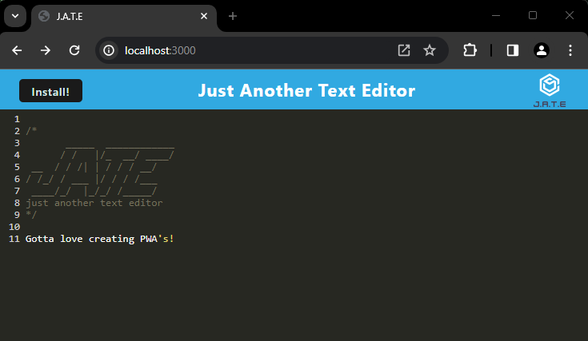

# Text Editor Progressive Web Application (PWA)

## Description

The application J.A.T.E (Just Another Text Editor) is a web text editor where the user can create notes or code snippets with or without an internet connection and where the user can reliably retrieve them for later use.  The integrated service worker and Cache API's ensure that the application will remain fully functional even without and active internet connection.  This application allows the user to access visited pages even if the application is offline.

The application has been deployed on Render. The deployed application is located here ==> https://text-editor-pwa-lgie.onrender.com

## Installation

* This application will require the installation of Node.js and various npm packages.

* The required modules are bundled in the package.json file and at CLI or integrated terminal type in **npm run install**, the modules will be installed.

## Usage

After performing "npm run install", execute "npm run start" in the integreated terminal from the root directory. 

Once in the application, you can add or remove text/code snippets as needed. If you are in offline mode the data will be saved with IndexedDB.

Feel free to install the application on your device to make it mobile! Again, whether you are connected to the internet or in an offline mode, the J.A.T.E App will still function as intended. 

## Credits
* Starter code was given for this project
* Module 19: Progressive Web Applications (PWA)
* Module 19 Mini-project 
* Render Deployment Guide on The Full-Stack Blog

## License

* NA
